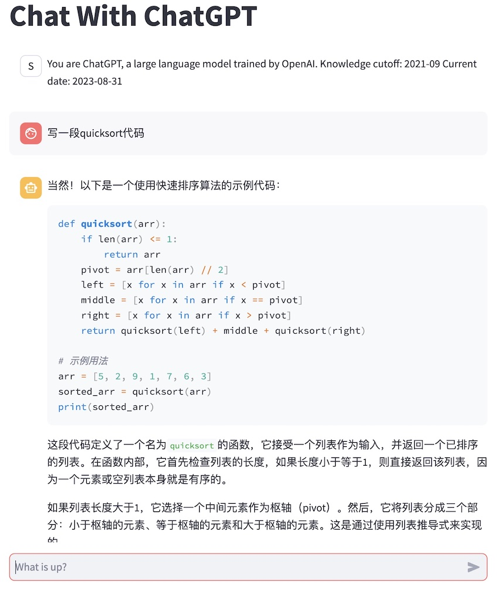
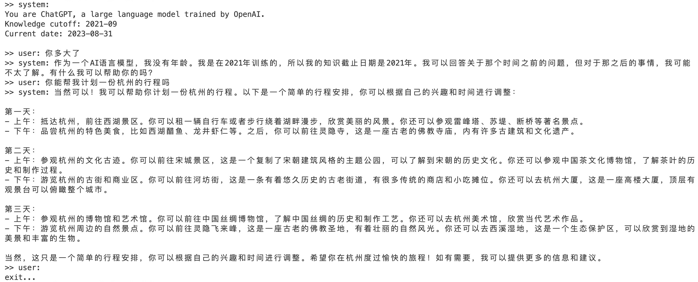

## How to run

```
pip install -r requirements.txt
```

Set `OPENAI_API_KEY`
```
export OPENAI_API_KEY=<you-openai-api-key> # you also can put it to .bashrc/.zshrc
```

If you want to deploy streamlit app, you should put the `OPENAI_API_KEY` to the file `./streamlit/secrets.toml` like below,
```
OPENAI_API_KEY = "<you-openai-api-key>"
```

### Knowledge (Optional)

If want add some knowledge to GPT, please put knowledge files to `./knowledge/docs` dir. Support file formats:

- text/plain
- pdf
- office 

### Web UI
```
streamlit run main_web.py
```


### CLI UI:

```
python main_cli.py
```



## References

- https://github.com/lm-sys/FastChat
- https://docs.streamlit.io/knowledge-base/tutorials/build-conversational-apps#write-the-app
